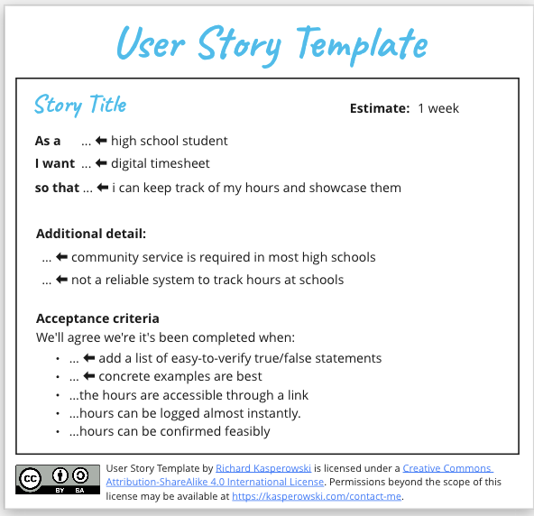

# Community Connect
https://buspark.atlassian.net/jira/software/projects/CC/boards/12/backlog

### Team
Raquel Joseph - Leader/Tech\
Amir Gabal - Tech\
Adriana Alvarado - Tech\
Moonis Thadey - Tech\
Sissi W - UX Design

### Sprint Planning
Community Connect has a long way to go so for this sprint we decided to work on the timesheet with as little design as possible to ensure that the functionality is stable.

Since our current focus for the sprint is mainly functionality, Sissi would continue working on the design aspect. To efficiently work through the week. We divided our work by the front and back end. Moonis and Adriana will work on the front end while Amir and Raquel work on the back end.

Most of the code for this weeks sprint will consist of HTML and SQL (as the database for the timesheet).

### Daily Scrum - February 27th
