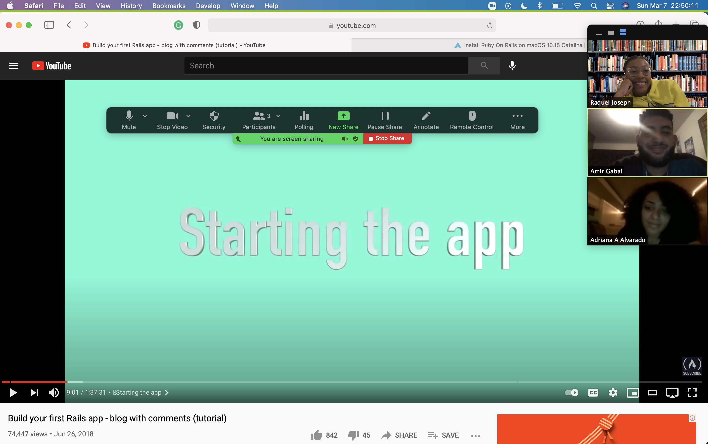

### Build Sprint 1
This week's build sprint was a little difficult for us. We were a little confused all together about how to start our project because originally we chose to use sinatra but we kept getting multiple errors. We disccussed this with our mentor and he suggested that we try using a framework such as ruby on rails.

We all got together to meet and install ruby on rails which gave us a number of issues in itself.

Finally, after two hours of installing and figuring out all the bugs we got to start a tutorial to learn ruby on rails.

We have deployed our app at [here](https://community-connect-1.herokuapp.com).

We were not able to finish the tutorial before class so we plan on finishing it and implementing it to our app today. We also plan on completing at least 2 stories by the end of the week.

### Daily Scrum
#### What did you do in the last 24 hours that helped the Development Team meet the Sprint Goal?

*Raquel* - In the last 24 hours, I installed ruby on rails and began implementing the project with rails instead of sinatra.

*Amir* - In the last 24 hours, I installed ruby on rails and watched a tutortal to help Raquel implent it into our project.

*Sissi* - In the last 24 hours I worked on the wireframe and made changes.

*Adriana* - In the last 24 hours, I met with Raquel and Amir so that we could peer program on zoom. I installed ruby on rails and watched the tutorial so that I could give assistance.

*Moonis* - In the last 24 hours, I worked on the HTMTL code.

#### What will you do in the next 24 hours to help the Development Team meet the Sprint Goal?

*Raquel* - In the next 24 hours, I will have finished watching the tutorial and fully implement ruby on rails to our project.

*Amir* - In the next 24 hours I will continue work on learning ruby on rails.

*Sissi* - In the next 24 hours I will continue to work on the wireframe and work on logo.

*Adriana* - In the next 24 hours I will continue work on learning ruby on rails and adding to the front end, possibly add css.

*Moonis* - In the next 24 hours, I shall continue working on my code and make changes as i see fit.

#### Do you see any impediment that prevents you or the Development Team from meeting the Sprint Goal? What are the impediments? What is your impediment removal plan?

Now that our first build sprint was conducted. I see that some impediments may be unforseen errors that we're not sure how to fix. We plan on meeting with our mentors more often and communicating to resolve this problem.
