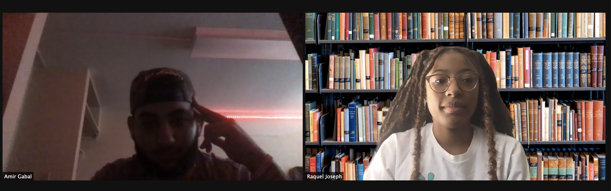
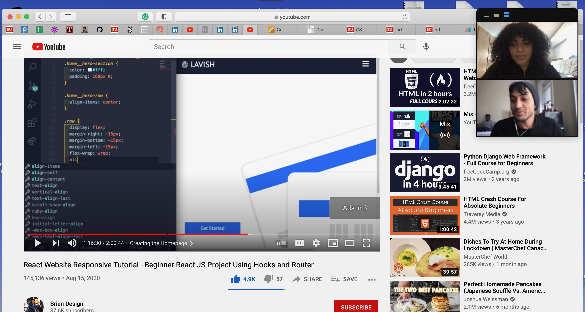

### Build Sprint 4
In this sprint my team and I learned React for the front end development while simultaneously working on login and registration authentification.

### Daily Scrum
#### What did you do in the last 24 hours that helped the Development Team meet the Sprint Goal?

*Raquel* - In the last 24 hours, I worked on adding the login and registration authentification.

*Amir* - In the last 24 hours, I worked on adding the login and registration authentification.

*Sissi* - In the last 24 hours, I worked creating a more user friendly wireframe.

*Adriana* - In the last 24 hours, I worked with Moonis to watch tutorials and learn React.

*Moonis* - In the last 24 hours, I worked with Adriana to watch tutorials and learn React.

#### What will you do in the next 24 hours to help the Development Team meet the Sprint Goal?

*Raquel* - In the next 24 hours, I will create an indiviual databse timesheet for each registered user.

*Amir* - In the next 24 hours, I will create an indiviual databse timesheet for each registered user.

*Sissi* - In the next 24 hours, I will continue to work on the wireframe and work on logo.

*Adriana* - In the next 24 hours, I will implement React to the app.

*Moonis* - In the next 24 hours, I will implement React to the app.

#### Do you see any impediment that prevents you or the Development Team from meeting the Sprint Goal? What are the impediments? What is your impediment removal plan?

The same issue that we had last week still remains. We need to create individual timesheet database for each user. We plan on fixing this by watching a few tutorials.
