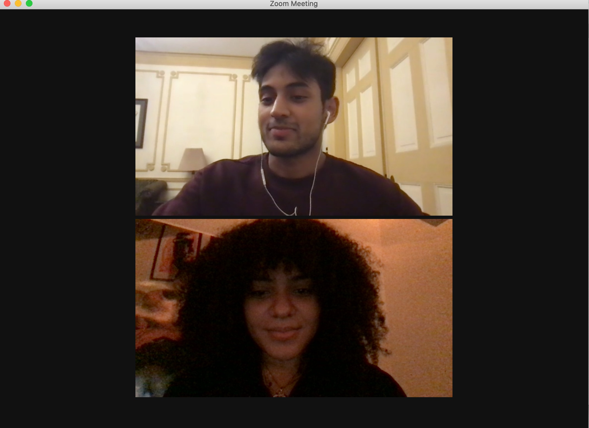

### Build Sprint 5
In this sprint, we were able to create a separate timesheet for each user that registers for the app. We also continued to learn more about react.

### Daily Scrum
#### What did you do in the last 24 hours that helped the Development Team meet the Sprint Goal?

*Raquel* - In the last 24 hours, I worked understanding the user stories for employers and how we should implement them to the app.

*Amir* - In the last 24 hours, I worked understanding the user stories for employers and how we should implement them to the app.

*Sissi* - In the last 24 hours, I worked finalizing the logo.

*Adriana* - In the last 24 hours, I worked with Moonis to watch tutorials and learn React.

*Moonis* - In the last 24 hours, I worked with Adriana to watch tutorials and learn React.

#### What will you do in the next 24 hours to help the Development Team meet the Sprint Goal?

*Raquel* - In the next 24 hours, I will create a working upload option for employers to add their opportunities.

*Amir* - In the next 24 hours, I will create a working upload option for employers to add their opportunities.

*Sissi* - In the next 24 hours, I will continue to work on the logo.

*Adriana* - In the next 24 hours, I will implement React to the app.

*Moonis* - In the next 24 hours, I will implement React to the app.

#### Do you see any impediment that prevents you or the Development Team from meeting the Sprint Goal? What are the impediments? What is your impediment removal plan?

We have no issues at the moment.
