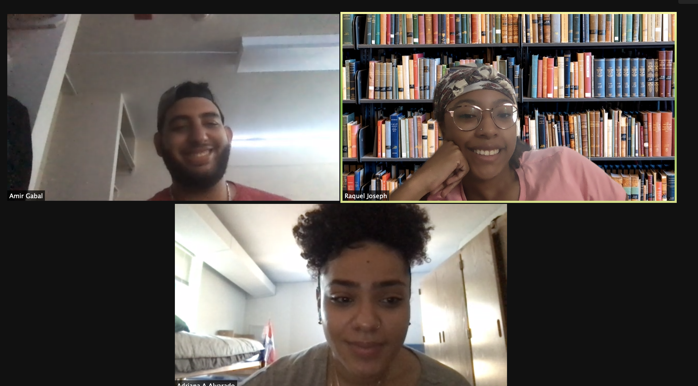
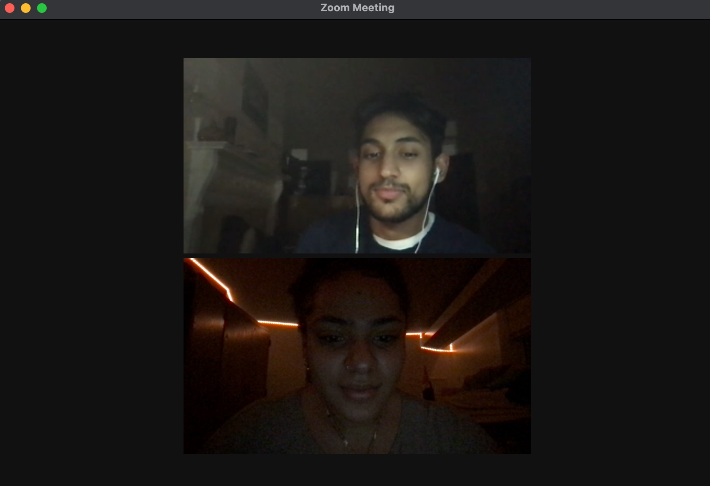

### Build Sprint 7
In this sprint we spent the time learning React and trying to implement it to our app. We have been struggling because we realized it is difficult adding React to an existing ruby on rails app.

### Daily Scrum
#### What did you do in the last 24 hours that helped the Development Team meet the Sprint Goal?

*Raquel* - In the last 24 hours, I helped the front end team with their React installation.

*Amir* - In the last 24 hours, I helped the front end team with their React installation.

*Sissi* - In the last 24 hours, I added the logos to the design and made some rearrangements.

*Adriana* - In the last 24 hours, I integrated react with rails, yet, continued to go through with html and css for the front end for now.

*Moonis* - In the last 24 hours, I worked on the front end and on my slides for the presentation.

#### What will you do in the next 24 hours to help the Development Team meet the Sprint Goal?

*Raquel* - In the next 24 hours, I will create a send email to organizers to verify hours for users.

*Amir* - In the next 24 hours, I will create a log out function.

*Sissi* - In the next 24 hours, I plan to meet with our mentor and start working on the hifi wireframes.

*Adriana* - In the next 24 hours, I want to add react to the front end and figure out whether or not it’s style would be better for our front end.

*Moonis* - In the next 24 hours,  I will work on  adding more design to the application.

#### Do you see any impediment that prevents you or the Development Team from meeting the Sprint Goal? What are the impediments? What is your impediment removal plan?

We are still struggling with React and it seems to not like Ruby on Rails. We plan on switching to another style framework if react still does not work by the middle of the week. We will most likely switch to using primarily bootstrap and css.
